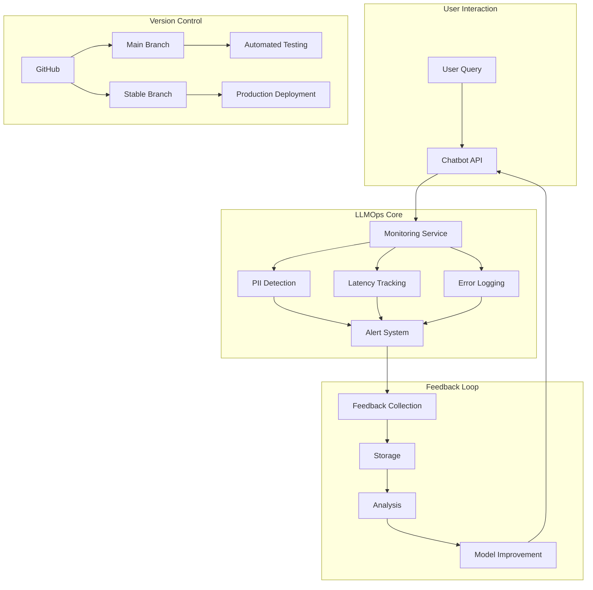

# LLMOps Foundations Bootcamp Project

## 📋 Overview

This project implements a comprehensive LLMOps foundation for a customer-facing chatbot, addressing monitoring, feedback collection, version control, and disaster recovery.

## 🏗️ System Architecture

