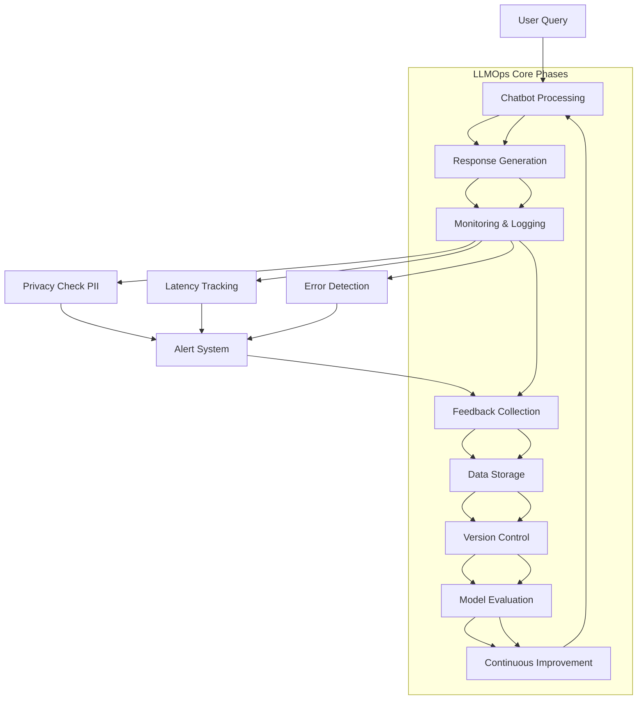

# LLMOps Lifecycle for Chatbot

## Overview

This document outlines the complete LLMOps lifecycle for our customer-facing chatbot, showing how we deploy, monitor, evaluate, version, and improve the system.

## Lifecycle Diagram

