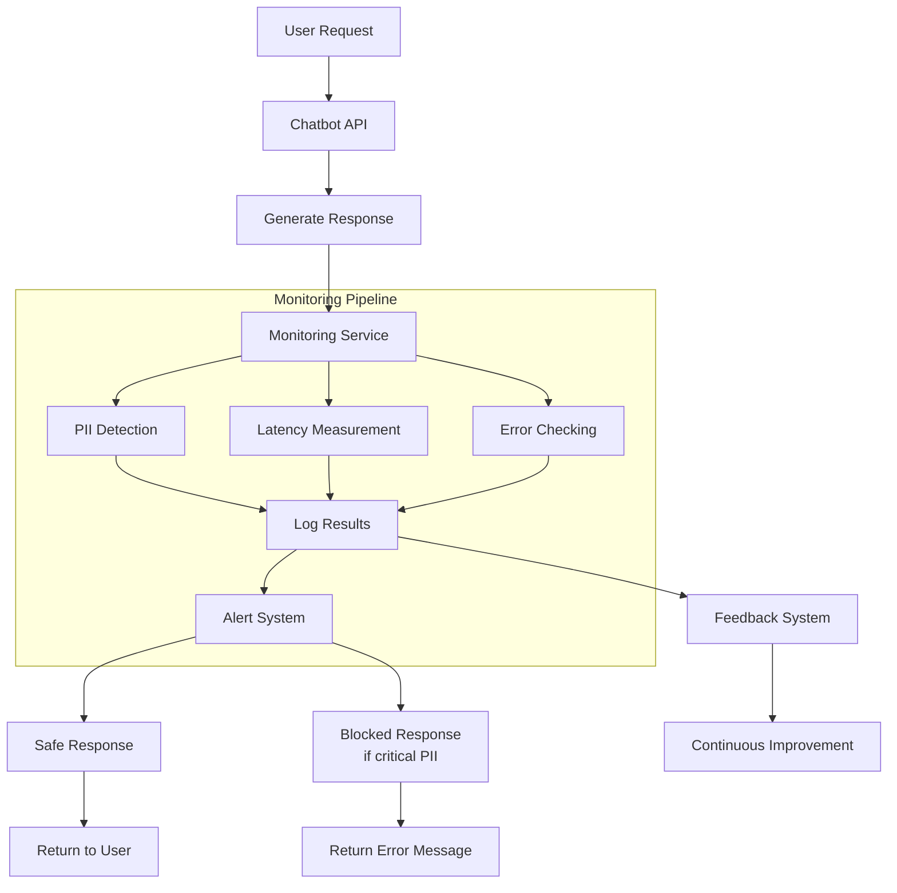

````markdown
# Chatbot Monitoring Flow

## Overview

This document describes the monitoring pipeline for our chatbot system, including PII detection, latency tracking, and error handling.

## Monitoring Architecture


````
